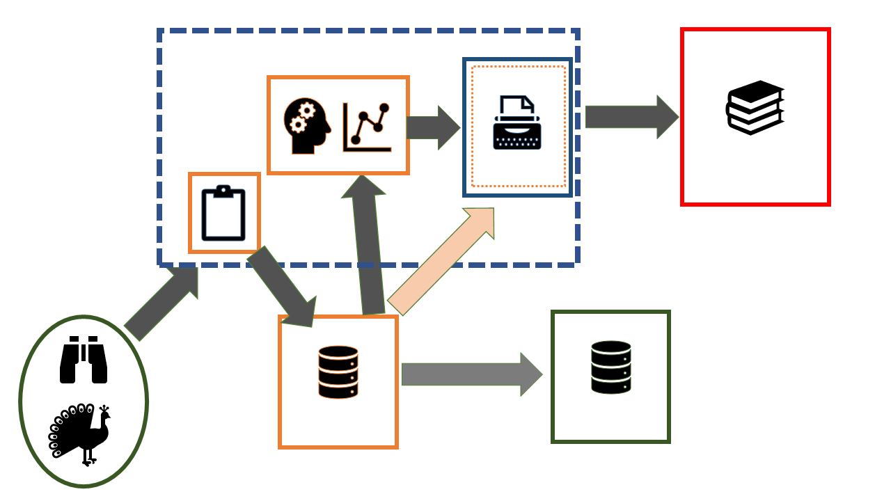

```{r setup, include=FALSE}
knitr::opts_chunk$set(echo = FALSE)
```

## 1. Can you imagine how this could be applied to questions in your area of research...

We can see how it is useful for occurrence data, but also it would be useful for the typical monitoring data we deal with at NINA - these can include abundance data, "hunting bags", etc. 

## 2. Are there any concepts that are not well explained

- **Assessment resolution** The bias(es) comes from infering Assessment resolution from an inappropriate data resolution
- **Geographic resolution** The Geographic domain needs to be better linked to the question - we might only be interested in a poltical boundary e.g. Norway eventhough we know the species distributions of most (all) of our target species extends over the border to Sweden and beyond
- **Environmental/Taxonomic resolution** Both need to be explicitly tied to the population of interest (to answer the question of interest)

- **Bias Mitigation** - the two explanations appear to be the same

## 4. Do you think it would be useful/possible to deal with other general types of biases...

- It might be useful to get the user to think about "site selection bias" (where declining populations are chosen for monitoring programmes because they are declining) but we are not sure how you can always identify this in a dataset
- This paper about politics and data is just out: https://onlinelibrary.wiley.com/doi/10.1111/jbi.14256?fbclid=IwAR1CihjdzVLv26nkKqBdJDOL8VNlfbMkjQ36PcDPI2HyWzvqTLu_qcwVHs4
- model mis-specification, data dredging etc. seem to be an extra step on from this (this is perhaps bias in the actions/method of the researcher rather than from the dataset and data generating mechanisms)

## 6. Are you happy with the format? Could we improve it (e.g. would a RShiny app be more useful)?

- We vote for Shiny!
- In addition, we think a stand alone R package with helper functions and a Rmarkdown template (can be also generated in the Shiny App) would be helpful

## 7. How is supporting/explanatory information best communicated?

- Website with html popups (can do this easily with GitHubPages)

## 8. How do we increase uptake in the research community? (Might be suggestions for tool/paper, or other approaches)
- Needs to become an expected part of research (paper/grant etc)
- Make it as easy as possible to create a "report" from the tool
- Target journal editors in any further consultation (how can their current systems be adapted to accept ROBITT)

## 9. Anything else

- Version control on the tool or with time stamping
- R package development
  - Functions for data cleaning
  - Functions for bias assessment


## LivingNorwayR
{width=70%}

## 

Takes raw data and maps to DwC-a (aimed toward GBIF)

Takes DwC-a and explores the data for use 


```{r, echo=FALSE, message=FALSE, warning=FALSE}
library(R6)
library(magrittr)
library(leaflet)
#Testing and playing with R6 Class

DwCOccurence<-R6::R6Class("DwCOccurence",
                          list(id= NULL,
                               ownerInstitutionCode= NULL,
                               basisOfRecord= NULL,
                               dynamicProperties= NULL,
                               occurrenceID= NULL,
                               sex= NULL,
                               lifeStage= NULL,
                               organismID= NULL,
                               organismName= NULL,
                               eventDate= NULL,
                               eventTime= NULL,
                               country= NULL,
                               countryCode = NULL,
                               locality         = NULL,
                               decimalLatitude= NULL,
                               decimalLongitude= NULL,
                               geodeticDatum= NULL,
                               coordinateUncertaintyInMeters= NULL,
                               taxonID= NULL,
                               scientificName= NULL,
                               kingdom= NULL,
                               phylum= NULL,
                               class= NULL,
                               order= NULL,
                               family= NULL,
                               genus= NULL,
                               initialize = function(id,ownerInstitutionCode,basisOfRecord,
                                                     dynamicProperties,
                                                     occurrenceID,
                                                     sex,
                                                     lifeStage,
                                                     organismID,
                                                     organismName,
                                                     eventDate,
                                                     eventTime,
                                                     country,
                                                     countryCode ,
                                                     locality         ,
                                                     decimalLatitude,
                                                     decimalLongitude,
                                                     geodeticDatum,
                                                     coordinateUncertaintyInMeters,
                                                     taxonID,
                                                     scientificName,
                                                     kingdom,
                                                     phylum,
                                                     class,
                                                     order,
                                                     family,
                                                     genus,...){
                                 self$id<-id
                                 self$ownerInstitutionCode<-ownerInstitutionCode
                                 self$basisOfRecord<-basisOfRecord
                                 self$dynamicProperties<-dynamicProperties
                                 self$occurrenceID<-occurrenceID
                                 self$sex<-sex
                                 self$lifeStage<-lifeStage
                                 self$organismID<-organismID
                                 self$organismName<-organismName
                                 self$eventDate<-eventDate
                                 self$eventTime<-eventTime
                                 self$country<-country
                                 self$countryCode <-countryCode
                                 self$locality         <-  locality
                                 self$decimalLatitude<-decimalLatitude
                                 self$decimalLongitude<-decimalLongitude
                                 self$geodeticDatum<-  geodeticDatum
                                 self$coordinateUncertaintyInMeters<-coordinateUncertaintyInMeters
                                 self$taxonID<-taxonID
                                 self$scientificName<-scientificName
                                 self$kingdom<-kingdom
                                 self$phylum<-phylum
                                 self$class<-class
                                 self$order<-order
                                 self$family<- family
                                 self$genus<-genus
                                 self$object()
                               },
                               object=function(...){
                                 object<-data.frame(id=id,
                                                    ownerInstitutionCode=
                                                      ownerInstitutionCode,
                                                    basisofRecord=self$basisOfRecord,
                                                    dynamicProperties=self$dynamicProperties,
                                                    occurrenceID= self$occurrenceID,
                                                    sex= self$sex,
                                                    lifeStage= self$lifeStage,
                                                    organismID= self$organismID,
                                                    organismName= self$organismName,
                                                    eventDate= self$eventDate,
                                                    eventTime= self$eventTime,
                                                    country= self$country,
                                                    countryCode= self$countryCode,
                                                    locality= self$locality,
                                                    decimalLatitude= self$decimalLatitude,
                                                    decimalLongitude= self$decimalLongitude,
                                                    geodeticDatum= self$geodeticDatum,
                                                    coordinateUncertaintyInMeters= self$coordinateUncertaintyInMeters,
                                                    taxonID= self$taxonID,
                                                    scientificName= self$scientificName,
                                                    kingdom= self$kingdom,
                                                    phylum= self$phylum,
                                                    class= self$class,
                                                    order= self$order,
                                                    family= self$family,
                                                    genus= self$genus
                                 )},
                               get_bounding_box=function(...){
                                 minX=min(self$decimalLongitude)
                                 maxX=max(self$decimalLongitude)
                                 minY=min(self$decimalLatitude)
                                 maxY=max(self$decimalLatitude)
                                 print(c(
                                   "minX"=minX,
                                   "maxX"=maxX,
                                   "minY"=minY,
                                   "maxY"=maxY))
                                 
                               },
                               plotmap=function(...){
                                 df=data.frame(id=id,
                                               occurrenceID= self$occurrenceID,
                                               sex= self$sex,
                                               lifeStage= self$lifeStage,
                                               organismID= self$organismID,
                                               organismName= self$organismName,
                                               eventDate= self$eventDate,
                                               eventTime= self$eventTime,
                                               decimalLatitude= self$decimalLatitude,
                                               decimalLongitude= self$decimalLongitude,
                                               geodeticDatum= self$geodeticDatum,
                                               coordinateUncertaintyInMeters= self$coordinateUncertaintyInMeters)
                                 #coords=c(as.numeric(df$decimalLongitude), as.numeric(df$decimalLatitude))
                                 #print(df)
                                 #my.sf.point <- sf::st_as_sf(x = df, coords = c(decimalLongitude, decimalLatitude),
                                 #                           crs = "+proj=longlat +datum=WGS84")
                                 #print(my.sf.point)
                                 leaflet::leaflet() %>% addTiles() %>% addMarkers(lng=df$decimalLongitude,
                                                                                  lat=df$decimalLatitude, popup = paste0(
                                                                                    "<b>Sex: </b>"
                                                                                    ,df$sex
                                                                                    
                                                                                    ,"<b>  eventDate: </b>"
                                                                                    ,df$eventDate
                                                                                  ))
                                 
                               }))
```

```{r, echo=FALSE, message=FALSE, warning=FALSE}
occurrence <- read.delim("C:/Users/matthew.grainger/Documents/Projects_in_development/LNC2020_presentation/slides/Tetraonidae_Lagopus/data/derived/occurrence.txt")

Rock<-DwCOccurence$new(
  id<-occurrence$id,
  ownerInstitutionCode<-occurrence$ownerInstitutionCode,
  basisOfRecord<-occurrence$basisOfRecord,
  dynamicProperties<-occurrence$dynamicProperties,
  occurrenceID<-occurrence$occurrenceID,
  sex<-occurrence$sex,
  lifeStage<-occurrence$lifeStage,
  organismID<-occurrence$organismID,
  organismName<-occurrence$organismName,
  eventDate<-occurrence$eventDate,
  eventTime<-occurrence$eventTime,
  country<-occurrence$country,
  countryCode<-occurrence$countryCode ,
  locality<-occurrence$locality         ,
  decimalLatitude<-occurrence$decimalLatitude,
  decimalLongitude<-occurrence$decimalLongitude,
  geodeticDatum<-occurrence$geodeticDatum,
  coordinateUncertaintyInMeters<-occurrence$coordinateUncertaintyInMeters,
  taxonID<-occurrence$taxonID,
  scientificName<-occurrence$scientificName,
  kingdom<-occurrence$kingdom,
  phylum<-occurrence$phylum,
  class<-occurrence$class,
  order<-occurrence$order,
  family<-occurrence$family,
  genus<-occurrence$genus)

```


```{r, echo=TRUE, eval=FALSE}
Rock<-DwCOccurence$new(
  id<-occurrence$id,
  ownerInstitutionCode<-occurrence$ownerInstitutionCode,
  basisOfRecord<-occurrence$basisOfRecord,
  dynamicProperties<-occurrence$dynamicProperties,
  occurrenceID<-occurrence$occurrenceID,
  ...,
  decimalLatitude<-occurrence$decimalLatitude,
  decimalLongitude<-occurrence$decimalLongitude,
  ...)
```


## Plotting functions

```{r, echo=TRUE}
Rock$plotmap()
```

## LivingNorwayR to ROBITT synergies 

- We have functions that with a little adaptation can be used to explore biases 
- Extracting metadata from (GBIF) data repositories and including these in the ROBITT RMarkdown or Shiny template would be straight forward
- We can see a ROBITT form/tool being a step in the process of LivingNorwayR


